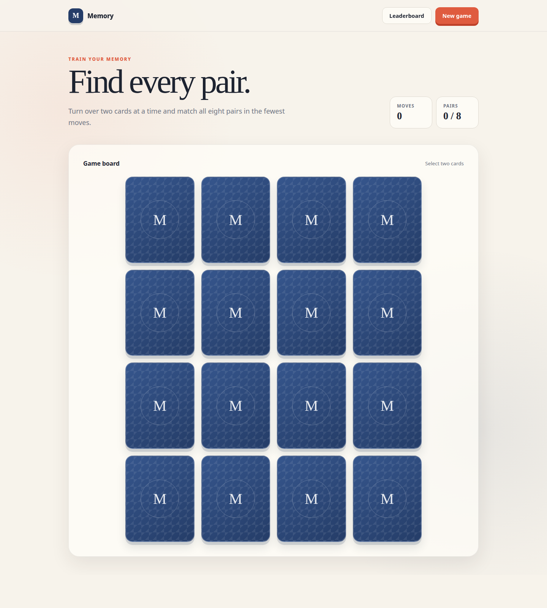

# Memory Game

A responsive browser card-matching game built with vanilla JavaScript. Turn over two cards at a time, remember their positions, and find all eight pairs in as few moves as possible.

[Play Memory Game](https://yessethumanman.github.io/memory-game/)



## Features

- 16 cards with 8 distinct matching pairs
- Fisher–Yates shuffle on initial load and every new game
- move and matched-pair counters
- one-second preview for mismatched cards
- input locking while a mismatched pair is visible
- immediate restart with active timer cancellation
- victory modal with the final score
- persistent top-10 leaderboard using `localStorage`
- ranking by fewest moves and then earliest completion date
- shared accessible modal component
- keyboard navigation, focus management, and reduced-motion support
- responsive layout for mobile, tablet, and desktop screens

## How to play

1. Select a closed card to reveal its image.
2. Select a different closed card.
3. Matching cards remain open. Mismatched cards close after one second.
4. Continue until all eight pairs are matched.
5. Try to complete the board using the fewest moves.

One move is counted whenever a valid second card is opened, whether or not the pair matches.

## Technology

- semantic HTML
- CSS Grid, responsive styles, and 3D card transitions
- vanilla JavaScript
- Web Storage API

The application does not use UI frameworks or third-party game-logic libraries. All interface elements—including the header, board, cards, counters, tables, messages, and modal windows—are created with `document.createElement`.

## Local setup

No package installation or build step is required.

1. Clone the repository:

   ```bash
   git clone https://github.com/YessetHumanMan/memory-game.git
   ```

2. Open the project directory and switch to the application branch:

   ```bash
   cd memory-game
   git switch memory-game
   ```

3. Start a local static server. For example, with Python:

   ```bash
   python3 -m http.server 8080
   ```

4. Open [http://localhost:8080](http://localhost:8080) in a browser.

You can also use any editor extension or static web server, such as VS Code Live Server.

## Project structure

```text
memory-game/
├── assets/
│   ├── cards/                  # Local SVG card illustrations
│   └── memory-game-preview.png
├── app.js                      # UI generation and application logic
├── index.html                  # Document shell; body contains only the script
├── style.css                   # Layout, card, modal, and responsive styles
└── README.md
```

## Game state and leaderboard

An unfinished game is kept only in memory and is discarded after a reload or restart. Completed results are saved under the `memory-game-results` key in `localStorage`.

Each result contains:

- the final move count;
- the completion timestamp.

Only the ten best valid results are retained. Lower move counts rank higher; equal scores are ordered by the earlier completion time. Dates are displayed as `DD.MM.YYYY` without a time value.

## Accessibility

- cards and controls use native buttons;
- closed cards do not expose their hidden identity in accessible labels;
- counters and game guidance use live regions;
- modal windows trap focus and make the background inert;
- modals close with their close button, the backdrop, or `Escape`;
- focus returns to an available control after a modal closes;
- visible keyboard focus styles are provided;
- reduced-motion preferences are respected.

## Assets

Card illustrations use icons from [Lucide](https://lucide.dev/) obtained through [Iconify](https://iconify.design/). Lucide icons are available under the [ISC License](https://github.com/lucide-icons/lucide/blob/main/LICENSE).
